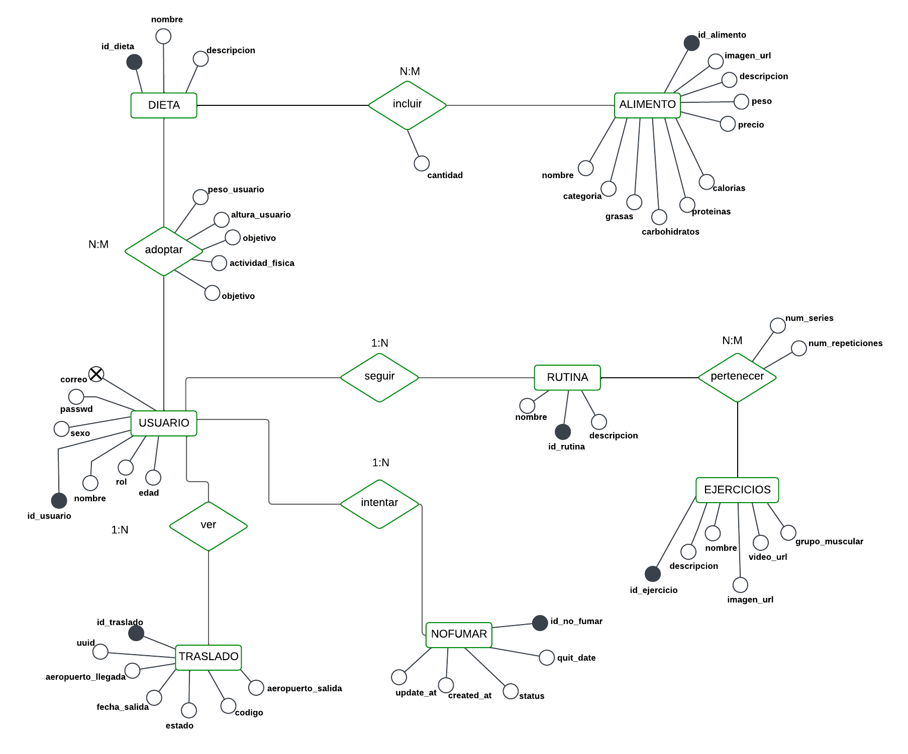

# MoveOn 🌍💪

## Sobre Nosotros

MoveOn es una plataforma creada por **Miguel Ángel Grima López** y **Miguel Hernández Monllor** como proyecto final del ciclo DAW en el **Instituto Paco Molla**. Nace con la ilusión de ayudar a personas que desean mejorar su vida, ya sea cambiando de entorno, adoptando hábitos saludables o dejando atrás costumbres perjudiciales. 

Este proyecto representa el trabajo, esfuerzo y dedicación con tal de desarrollarnos mejor personalmente y profesionalmente, aplicando todo lo aprendido durante el curso.

## ¿Qué es MoveOn?

MoveOn es una aplicación web que ofrece un ecosistema de apoyo integral para quienes desean dar un giro a su vida. Entre sus funcionalidades principales se encuentran:

- 🏋️ **Rutinas de Ejercicio**: Diseñadas por expertos y adaptadas a todos los niveles, con vídeos demostrativos.
- 🥗 **Dietas Personalizadas**: Calculadora de macronutrientes, recetas saludables y planes según tus objetivos.
- 🚭 **Dejar de Fumar**: Contador de días sin tabaco, consejos motivacionales y seguimiento de ahorro económico.
- 🌍 **Ubicaciones Recomendadas**: Mapa interactivo con reseñas de usuarios sobre lugares propicios para comenzar de nuevo.
- 🗓️ **Calendario Integral**: Agenda para registrar comidas, ejercicios, metas y notas motivacionales.
- 🤖 **Ayudante de IA**: Asistentes virtuales para resolver dudas y ayudarte con entrenamientos o el uso de la plataforma.
- ✈️ **Vuelos del Día**: Consulta vuelos hacia países recomendados por la plataforma.

## Tecnologías Utilizadas 🛠️

El desarrollo del proyecto se ha realizado con una arquitectura moderna **frontend-backend**, empleando las siguientes tecnologías:

- **Frontend**: React JS con Tailwind CSS
- **Backend**: PHP con Laravel
- **Base de datos**: MySQL (gestionada con Docker)
- **Contenedores**: Docker & Docker Compose
- **Gestión de dependencias Frontend**: npm
- **IDE recomendados**: 
  - Visual Studio Code (Frontend)
  - PhpStorm (Backend)

## Instalación 🔧

Para poner en marcha el proyecto localmente, sigue estos pasos:

### Requisitos Previos

- Tener instalado [Node.js](https://nodejs.org/) (para el frontend)
- Tener instalado [Docker y Docker Compose](https://www.docker.com/)
- Editor de código recomendado: **VS Code** para frontend y **PHPStorm** para backend

### 1. Clonar el repositorio

```bash
git clone https://github.com/tu-usuario/tu-repo.git
cd tu-repo
```

### 2. Frontend

```bash
cd frontend
npm install
```

Asegúrate de tener un archivo `.env` correctamente configurado apuntando a tu servidor local, por ejemplo:

```
VITE_API_URL=http://localhost:8089/api
```

Después, puedes arrancar el frontend con:

```bash
npm run dev
```

Esto levantará la aplicación en:  
📍 `http://localhost:5173`

### 3. Backend

```bash
cd backend
cp .env.example .env
```

Edita el archivo `.env` para asegurarte de que la configuración de la base de datos es correcta.

Luego, levanta los contenedores con Docker:

```bash
docker-compose up -d
```

Después, instala las dependencias de Laravel:

```bash
composer install
composer update
```

Finalmente, ejecuta las migraciones para crear las tablas necesarias:

```bash
php artisan migrate
```

El backend se ejecutará en:  
📍 `http://localhost:8089`

## Diagrama Entidad-Relación 🗃️

A continuación se muestra el diagrama entidad-relación de la base de datos del proyecto:  



## Agradecimientos 🙌

Gracias a nuestros profesores del **Instituto Paco Molla** por el apoyo durante todo el curso. Este proyecto es el reflejo del conocimiento adquirido y las ganas de crear algo útil para los demás.


